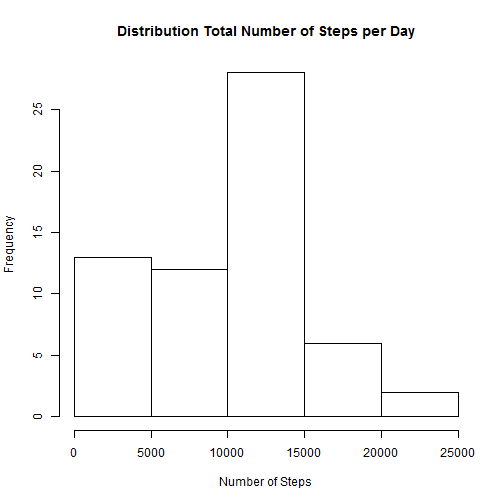
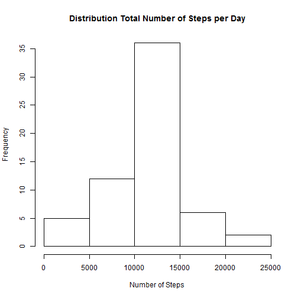

# Reproducible Research: Peer Assessment 1


## Loading and preprocessing the data

Setting the directory


```r
    currentDirectory <- getwd()
    newDirectory <- paste(currentDirectory,"/PeerAssessment1",sep="")
    if(!file.exists("PeerAssessment1")){dir.create("PeerAssessment1")}
    setwd(newDirectory)
```

downloading, unzipping and reading the data


```r
    setInternet2()
    file<-"https://d396qusza40orc.cloudfront.net/repdata%2Fdata%2Factivity.zip"
    download.file(file,"data.zip")    
    unzip("data.zip")
    data <- read.csv("activity.csv")
```

loading required packages


```r
    install.packages("lattice",repos="http://cran.us.r-project.org")
```

```
## Installing package into 'C:/Users/Sebastian Stenzel/Documents/R/win-library/3.0'
## (as 'lib' is unspecified)
```

```
## package 'lattice' successfully unpacked and MD5 sums checked
```

```
## Warning: cannot remove prior installation of package 'lattice'
```

```
## 
## The downloaded binary packages are in
## 	C:\Users\Sebastian Stenzel\AppData\Local\Temp\Rtmp8QiZ5I\downloaded_packages
```

```r
    library("lattice")
```

## What is mean total number of steps taken per day?

drawing the histogram


```r
    hist(tapply(data$steps,data$date,sum,na.rm=T),xlab="Number of Steps",
    main="Distribution Total Number of Steps per Day")
```

 

calculating mean number of total steps per day


```r
    MEAN <- mean(tapply(data$steps,data$date,sum,na.rm=T))
    MEAN
```

```
## [1] 9354
```

calculating median number of total steps per day


```r
    MEDIAN <- median(tapply(data$steps,data$date,sum,na.rm=T))
    MEDIAN
```

```
## [1] 10395
```

The **mean** and **median** number of total steps per day are **9354.2295** and **10395**.

## What is the average daily activity pattern?

calculating and drawing time series data for the average number of steps taken per time interval


```r
    TSdata<-tapply(data$steps,data$interval,mean,na.rm=T)
    plot(x=names(TSdata),y=TSdata,type="l", xlab="time inteval", ylab="number of steps",
    main="Number of Steps Averaged per Time Interval")
```

 


```r
    Maximum <- max(TSdata)
    MaxPos <- TSdata == Maximum
    (TSdata[MaxPos])
```

```
##   835 
## 206.2
```

```r
    MaxInterval <- names(TSdata[MaxPos])
```

The Interval **835** has on average the highest number of steps: **206.1698**


## Imputing missing values

Creating data frame *dataNaRm* in which missing values are replaced with the related interval's average.


```r
MissingValues <- is.na(data$steps)
IntervalMissingValues <- data[MissingValues,"interval"]
MeanValues<-sapply(IntervalMissingValues,function(x){y<-x==names(TSdata);TSdata[y]})
dataNaRm <- data
dataNaRm[is.na(dataNaRm$steps),"steps"] <- MeanValues
```

### ploting the histogram with the **new** data


```r
    hist(tapply(dataNaRm$steps,data$date,sum,na.rm=T),xlab="Number of Steps",
    main="Distribution Total Number of Steps per Day")
```

 

calculating the **new** mean number of total steps per day


```r
    MEAN <- mean(tapply(dataNaRm$steps,data$date,sum,na.rm=T))
    MEAN
```

```
## [1] 10766
```

calculating the **new** median number of total steps per day


```r
    MEDIAN <- median(tapply(dataNaRm$steps,data$date,sum,na.rm=T))
    MEDIAN
```

```
## [1] 10766
```

Replacing missing values with mean interval values centralizes the distribution. This results in narrower distribution (see histogram) and a mean closer/equal to the median


## Are there differences in activity patterns between weekdays and weekends?


* transforming date data to date variable+


```r
    data<-transform(data,date=as.Date(strptime(date,"%Y-%m-%d")))
```

* adding weekday column


```r
    data$wkday<-weekdays(data$date)
```

* *optional replacing german with english weekday names*


```r
    data$wkday[data$wkday=="Montag"]<-"Monday"
    data$wkday[data$wkday=="Dienstag"]<-"Tuesday"
    data$wkday[data$wkday=="Mittwoch"]<-"Wednesday"
    data$wkday[data$wkday=="Donnerstag"]<-"Thursday"
    data$wkday[data$wkday=="Freitag"]<-"Friday"
    data$wkday[data$wkday=="Samstag"]<-"Saturday"
    data$wkday[data$wkday=="Sonntag"]<-"Sunday"
```

* adding weekday/weekend column


```r
    data$wkend<-rep("weekday",nrow(data))
    wkend<-data$wkday=="Saturday"|data$wkday=="Sunday"
    data$wkend[wkend]<-"weekend"
```

* splittin data into weekday and weekend data frames


```r
    WeekSepList<-split(data,data$wkend)
```

* computing interval means for weekday and weekend data seperately 


```r
    weekday<-tapply(WeekSepList$weekday$steps,WeekSepList$weekday$interval,mean,na.rm=T)
    weekend<-tapply(WeekSepList$weekend$steps,WeekSepList$weekend$interval,mean,na.rm=T)
```

* joining the data frames


```r
    weekday<-data.frame(steps=as.numeric(weekday),interval=as.numeric(names(weekday)),wkend="weekday")
    weekend<-data.frame(steps=as.numeric(weekend),interval=as.numeric(names(weekend)),wkend="weekend")
    WeekDayComparison<-rbind(weekday,weekend)
```

* plotting the graph


```r
    xyplot(WeekDayComparison$steps~WeekDayComparison$interval|WeekDayComparison$wkend,
    layout=c(1,2),xlab="Interval",ylab="Number of steps",panel=function(x,y,..){
    panel.xyplot(x,y,type="l")
    }) 
```

 


```r
    data$wkday<-weekdays(data$date)
```
