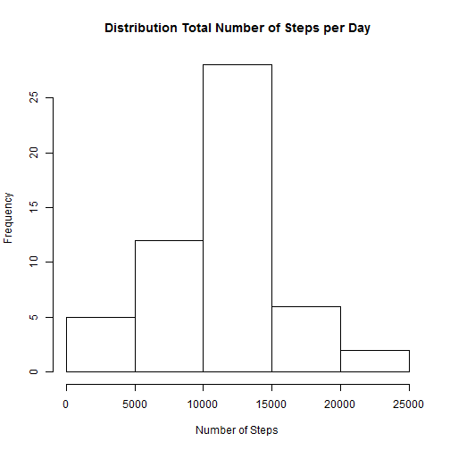
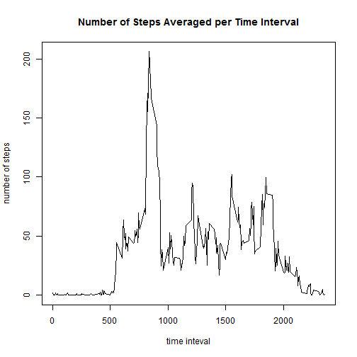
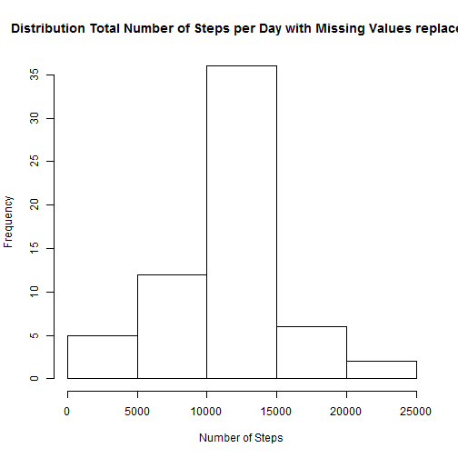

# Reproducible Research: Peer Assessment 1


## Loading and preprocessing the data

setting the directory:

```r
    currentDirectory <- getwd()
    newDirectory <- paste(currentDirectory,"/PeerAssessment1",sep="")
    if(!file.exists("PeerAssessment1")){dir.create("PeerAssessment1")}
    setwd(newDirectory)
```

downloading, unzipping and reading the data:

```r
    setInternet2()
    file <- "https://d396qusza40orc.cloudfront.net/repdata%2Fdata%2Factivity.zip"
    download.file(file,"data.zip")    
    unzip("data.zip")
    data <- read.csv("activity.csv")
```

loading required packages:

```r
    install.packages("lattice",repos="http://cran.us.r-project.org")
```

```
## Installing package into 'C:/Users/Sebastian Stenzel/Documents/R/win-library/3.0'
## (as 'lib' is unspecified)
```

```
## package 'lattice' successfully unpacked and MD5 sums checked
```

```
## Warning: cannot remove prior installation of package 'lattice'
```

```
## 
## The downloaded binary packages are in
## 	C:\Users\Sebastian Stenzel\AppData\Local\Temp\RtmpSAKf52\downloaded_packages
```

```r
    library("lattice")
```

## What is mean total number of steps taken per day?

computing distribution of total number of steps per day:

```r
    StepsPerDayTotal <- tapply(data$steps,data$date,sum,na.rm=T)
```

plotting the histogram:

```r
    hist(StepsPerDayTotal,xlab="Number of Steps",
    main="Distribution Total Number of Steps per Day")
```

 

computing and reporting mean **number** of **steps per day**:

```r
    StepsPerDayMean <- tapply(data$steps,data$date,mean,na.rm=T)
    StepsPerDayMean 
```

```
## 2012-10-01 2012-10-02 2012-10-03 2012-10-04 2012-10-05 2012-10-06 
##        NaN     0.4375    39.4167    42.0694    46.1597    53.5417 
## 2012-10-07 2012-10-08 2012-10-09 2012-10-10 2012-10-11 2012-10-12 
##    38.2465        NaN    44.4826    34.3750    35.7778    60.3542 
## 2012-10-13 2012-10-14 2012-10-15 2012-10-16 2012-10-17 2012-10-18 
##    43.1458    52.4236    35.2049    52.3750    46.7083    34.9167 
## 2012-10-19 2012-10-20 2012-10-21 2012-10-22 2012-10-23 2012-10-24 
##    41.0729    36.0938    30.6285    46.7361    30.9653    29.0104 
## 2012-10-25 2012-10-26 2012-10-27 2012-10-28 2012-10-29 2012-10-30 
##     8.6528    23.5347    35.1354    39.7847    17.4236    34.0938 
## 2012-10-31 2012-11-01 2012-11-02 2012-11-03 2012-11-04 2012-11-05 
##    53.5208        NaN    36.8056    36.7049        NaN    36.2465 
## 2012-11-06 2012-11-07 2012-11-08 2012-11-09 2012-11-10 2012-11-11 
##    28.9375    44.7326    11.1771        NaN        NaN    43.7778 
## 2012-11-12 2012-11-13 2012-11-14 2012-11-15 2012-11-16 2012-11-17 
##    37.3785    25.4722        NaN     0.1424    18.8924    49.7882 
## 2012-11-18 2012-11-19 2012-11-20 2012-11-21 2012-11-22 2012-11-23 
##    52.4653    30.6979    15.5278    44.3993    70.9271    73.5903 
## 2012-11-24 2012-11-25 2012-11-26 2012-11-27 2012-11-28 2012-11-29 
##    50.2708    41.0903    38.7569    47.3819    35.3576    24.4688 
## 2012-11-30 
##        NaN
```

computing and reporting median **number** of **steps per day**:

```r
    StepsPerDayMedian <- tapply(data$steps,data$date,median,na.rm=T)
    StepsPerDayMedian
```

```
## 2012-10-01 2012-10-02 2012-10-03 2012-10-04 2012-10-05 2012-10-06 
##         NA          0          0          0          0          0 
## 2012-10-07 2012-10-08 2012-10-09 2012-10-10 2012-10-11 2012-10-12 
##          0         NA          0          0          0          0 
## 2012-10-13 2012-10-14 2012-10-15 2012-10-16 2012-10-17 2012-10-18 
##          0          0          0          0          0          0 
## 2012-10-19 2012-10-20 2012-10-21 2012-10-22 2012-10-23 2012-10-24 
##          0          0          0          0          0          0 
## 2012-10-25 2012-10-26 2012-10-27 2012-10-28 2012-10-29 2012-10-30 
##          0          0          0          0          0          0 
## 2012-10-31 2012-11-01 2012-11-02 2012-11-03 2012-11-04 2012-11-05 
##          0         NA          0          0         NA          0 
## 2012-11-06 2012-11-07 2012-11-08 2012-11-09 2012-11-10 2012-11-11 
##          0          0          0         NA         NA          0 
## 2012-11-12 2012-11-13 2012-11-14 2012-11-15 2012-11-16 2012-11-17 
##          0          0         NA          0          0          0 
## 2012-11-18 2012-11-19 2012-11-20 2012-11-21 2012-11-22 2012-11-23 
##          0          0          0          0          0          0 
## 2012-11-24 2012-11-25 2012-11-26 2012-11-27 2012-11-28 2012-11-29 
##          0          0          0          0          0          0 
## 2012-11-30 
##         NA
```

calculating **mean** number of **total steps over all days**:

```r
    MEAN <- mean(StepsPerDayTotal)
    MEAN
```

```
## [1] 9354
```

calculating **median** number of **total steps over all days**:

```r
    MEDIAN <- median(StepsPerDayTotal)
    MEDIAN
```

```
## [1] 10395
```

The **mean** and **median** number of total steps over all days are **9354.2295** and **10395**.


## What is the average daily activity pattern?

calculating average number of steps taken per time interval, averaged across all days:

```r
    IntervalAverages <- tapply(data$steps,data$interval,mean,na.rm=T)
```

plotting time series data for the average number of steps taken per time interval:

```r
    plot(x=names(IntervalAverages),y=IntervalAverages,type="l", xlab="time inteval", 
    ylab="number of steps", main="Number of Steps Averaged per Time Interval")
```

 

computing the maximum:

```r
    Maximum <- max(IntervalAverages)
    MaxPos <- IntervalAverages == Maximum
    (IntervalAverages[MaxPos])
```

```
##   835 
## 206.2
```

```r
    MaxInterval <- names(IntervalAverages[MaxPos])
```

The Interval **835** has on average the highest number of steps: **206.1698**


## Imputing missing values

Creating data frame *dataNaRm* in which missing values are replaced with the related interval's average.

finding positions, intervals and the number of points for which no values were recorded:

```r
    MissingValues <- is.na(data$steps)
    NumberMissingValues <- sum(MissingValues)
    IntervalMissingValues <- data[MissingValues,"interval"]
    NumberMissingValues
```

```
## [1] 2304
```
For **2304** of the intervals in the dataset no values were recorded.


picking the mean interval values for those points from the *IntervalAverages* calculated above:

```r
    MeanValues <- sapply(IntervalMissingValues,function(MVInt)
      {MVIntMean <- MVInt==names(IntervalAverages);IntervalAverages[MVIntMean]})
```

creating new data frame *dataNaRm* where those missing values are replaced by the related interval means:

```r
    dataNaRm <- data
    dataNaRm[MissingValues,"steps"] <- MeanValues
```

### Ploting the histogram with the *new* data


```r
    hist(tapply(dataNaRm$steps,data$date,sum,na.rm=T),xlab="Number of Steps",
    main="Distribution Total Number of Steps per Day with Missing Values replaced")
```

 

computing and reporting the **new** mean number of **steps per day**:

```r
    StepsPerDayMean <- tapply(dataNaRm$steps,data$date,mean,na.rm=T)
    StepsPerDayMean 
```

```
## 2012-10-01 2012-10-02 2012-10-03 2012-10-04 2012-10-05 2012-10-06 
##    37.3826     0.4375    39.4167    42.0694    46.1597    53.5417 
## 2012-10-07 2012-10-08 2012-10-09 2012-10-10 2012-10-11 2012-10-12 
##    38.2465    37.3826    44.4826    34.3750    35.7778    60.3542 
## 2012-10-13 2012-10-14 2012-10-15 2012-10-16 2012-10-17 2012-10-18 
##    43.1458    52.4236    35.2049    52.3750    46.7083    34.9167 
## 2012-10-19 2012-10-20 2012-10-21 2012-10-22 2012-10-23 2012-10-24 
##    41.0729    36.0938    30.6285    46.7361    30.9653    29.0104 
## 2012-10-25 2012-10-26 2012-10-27 2012-10-28 2012-10-29 2012-10-30 
##     8.6528    23.5347    35.1354    39.7847    17.4236    34.0938 
## 2012-10-31 2012-11-01 2012-11-02 2012-11-03 2012-11-04 2012-11-05 
##    53.5208    37.3826    36.8056    36.7049    37.3826    36.2465 
## 2012-11-06 2012-11-07 2012-11-08 2012-11-09 2012-11-10 2012-11-11 
##    28.9375    44.7326    11.1771    37.3826    37.3826    43.7778 
## 2012-11-12 2012-11-13 2012-11-14 2012-11-15 2012-11-16 2012-11-17 
##    37.3785    25.4722    37.3826     0.1424    18.8924    49.7882 
## 2012-11-18 2012-11-19 2012-11-20 2012-11-21 2012-11-22 2012-11-23 
##    52.4653    30.6979    15.5278    44.3993    70.9271    73.5903 
## 2012-11-24 2012-11-25 2012-11-26 2012-11-27 2012-11-28 2012-11-29 
##    50.2708    41.0903    38.7569    47.3819    35.3576    24.4688 
## 2012-11-30 
##    37.3826
```

computing and reporting the **new** median number of **steps per day**:

```r
    StepsPerDayMedian <- tapply(dataNaRm$steps,data$date,median,na.rm=T)
    StepsPerDayMedian
```

```
## 2012-10-01 2012-10-02 2012-10-03 2012-10-04 2012-10-05 2012-10-06 
##      34.11       0.00       0.00       0.00       0.00       0.00 
## 2012-10-07 2012-10-08 2012-10-09 2012-10-10 2012-10-11 2012-10-12 
##       0.00      34.11       0.00       0.00       0.00       0.00 
## 2012-10-13 2012-10-14 2012-10-15 2012-10-16 2012-10-17 2012-10-18 
##       0.00       0.00       0.00       0.00       0.00       0.00 
## 2012-10-19 2012-10-20 2012-10-21 2012-10-22 2012-10-23 2012-10-24 
##       0.00       0.00       0.00       0.00       0.00       0.00 
## 2012-10-25 2012-10-26 2012-10-27 2012-10-28 2012-10-29 2012-10-30 
##       0.00       0.00       0.00       0.00       0.00       0.00 
## 2012-10-31 2012-11-01 2012-11-02 2012-11-03 2012-11-04 2012-11-05 
##       0.00      34.11       0.00       0.00      34.11       0.00 
## 2012-11-06 2012-11-07 2012-11-08 2012-11-09 2012-11-10 2012-11-11 
##       0.00       0.00       0.00      34.11      34.11       0.00 
## 2012-11-12 2012-11-13 2012-11-14 2012-11-15 2012-11-16 2012-11-17 
##       0.00       0.00      34.11       0.00       0.00       0.00 
## 2012-11-18 2012-11-19 2012-11-20 2012-11-21 2012-11-22 2012-11-23 
##       0.00       0.00       0.00       0.00       0.00       0.00 
## 2012-11-24 2012-11-25 2012-11-26 2012-11-27 2012-11-28 2012-11-29 
##       0.00       0.00       0.00       0.00       0.00       0.00 
## 2012-11-30 
##      34.11
```

calculating the **new** mean number of **total steps over all days**:

```r
    MEAN <- mean(tapply(dataNaRm$steps,data$date,sum,na.rm=T))
    MEAN
```

```
## [1] 10766
```

calculating the **new** median number of **total steps over all days**:

```r
    MEDIAN <- median(tapply(dataNaRm$steps,data$date,sum,na.rm=T))
    MEDIAN
```

```
## [1] 10766
```

Replacing missing values with mean interval values centralizes the distribution. This results in narrower distribution (see histogram) and a mean closer/equal to the median


## Are there differences in activity patterns between weekdays and weekends?


* transforming date data to date variable:

```r
    data <- transform(data,date=as.Date(strptime(date,"%Y-%m-%d")))
```

* adding weekday column:

```r
    data$wkday <- weekdays(data$date)
```

* *optional replacing german with english weekday names:*

```r
    data$wkday[data$wkday=="Montag"] <- "Monday"
    data$wkday[data$wkday=="Dienstag"] <- "Tuesday"
    data$wkday[data$wkday=="Mittwoch"] <- "Wednesday"
    data$wkday[data$wkday=="Donnerstag"] <- "Thursday"
    data$wkday[data$wkday=="Freitag"] <- "Friday"
    data$wkday[data$wkday=="Samstag"]<-"Saturday"
    data$wkday[data$wkday=="Sonntag"]<-"Sunday"
```

* adding weekday/weekend column:

```r
    data$wkend <- rep("weekday",nrow(data))
    wkend <- data$wkday=="Saturday"|data$wkday=="Sunday"
    data$wkend[wkend] <- "weekend"
```

* splitting data into weekday and weekend data frames:

```r
    WeekSepList <- split(data,data$wkend)
```

* computing-interval means for weekday and weekend data seperately:

```r
    weekday <- tapply(WeekSepList$weekday$steps,WeekSepList$weekday$interval,mean,na.rm=T)
    weekend <- tapply(WeekSepList$weekend$steps,WeekSepList$weekend$interval,mean,na.rm=T)
```

* joining to one data frame:

```r
    weekday <- data.frame(steps=as.numeric(weekday),interval=as.numeric(names(weekday)),wkend="weekday")
    weekend <- data.frame(steps=as.numeric(weekend),interval=as.numeric(names(weekend)),wkend="weekend")
    WeekDayComparison <- rbind(weekday,weekend)
```

* plotting the graph:

```r
    xyplot(WeekDayComparison$steps~WeekDayComparison$interval|WeekDayComparison$wkend,
    layout=c(1,2),xlab="Interval",ylab="Number of steps",panel=function(x,y,..){
    panel.xyplot(x,y,type="l")}) 
```

 
